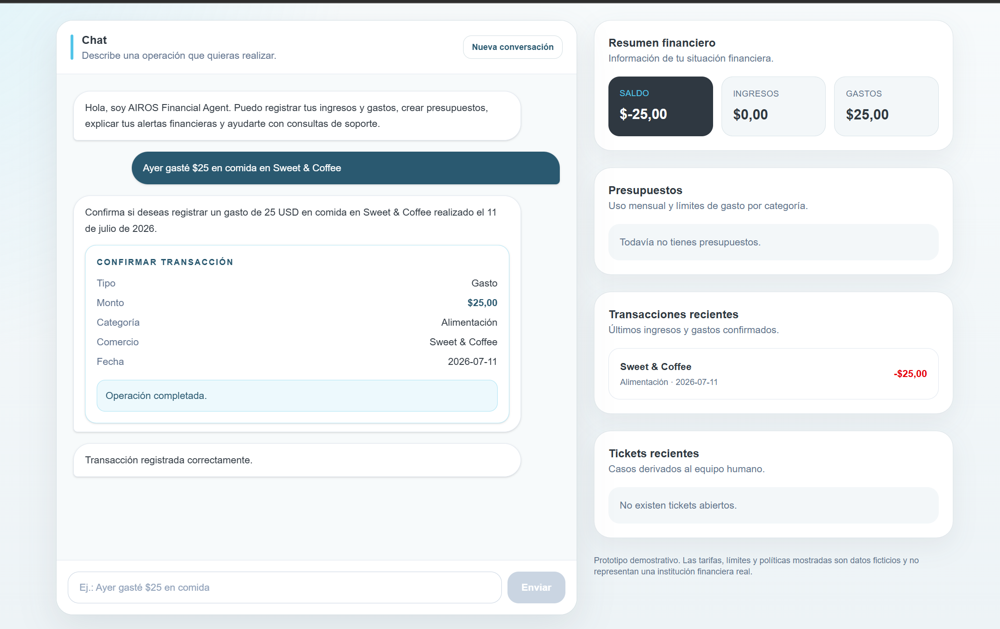
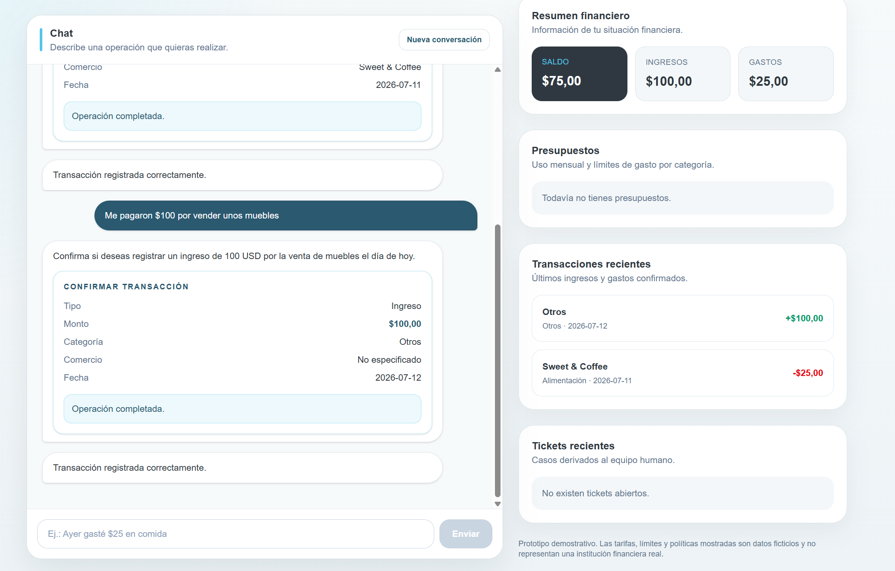
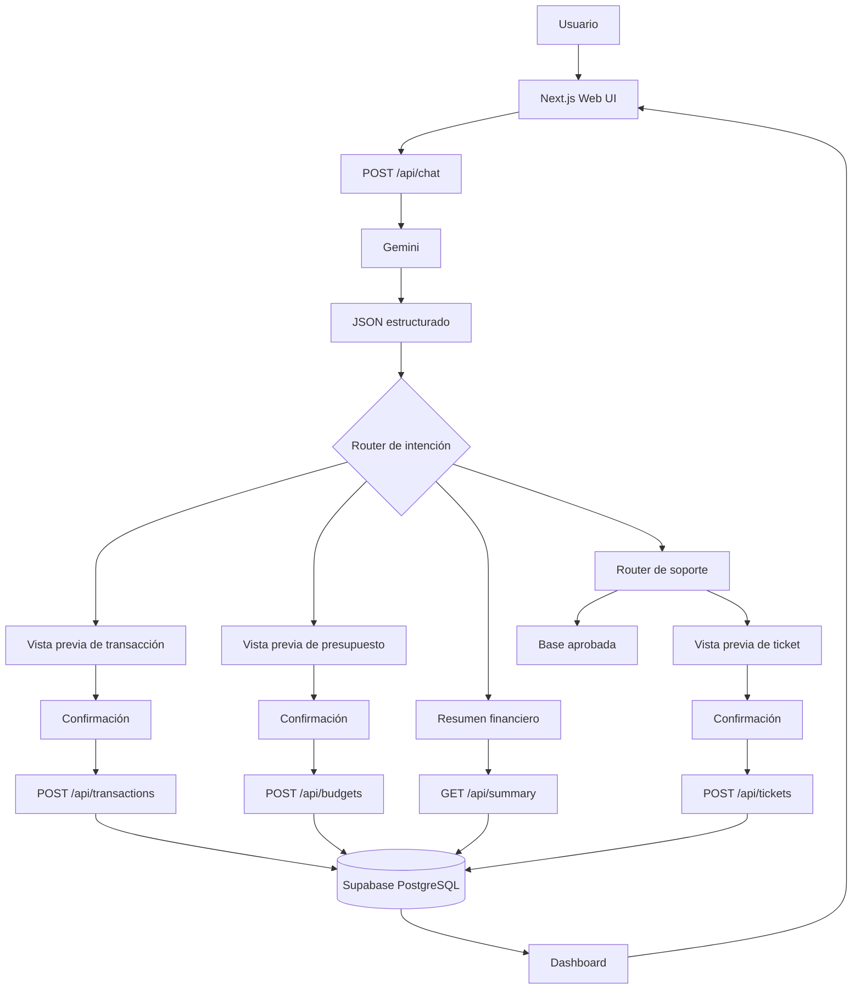

# AIROS Financial Agent

> Agente inteligente para finanzas personales, presupuestos y soporte financiero, desarrollado por AIROS para el **Agentic Scale Hackathon**.


---

## Descripción

**AIROS Financial Agent** es una aplicación web conversacional que permite:

- Registrar ingresos y gastos mediante lenguaje natural.
- Confirmar operaciones antes de guardarlas.
- Consultar un resumen financiero basado en datos persistidos.
- Crear presupuestos mensuales por categoría.
- Configurar umbrales de alerta.
- Comprender cuánto falta para alcanzar un umbral o cuánto se ha excedido.
- Consultar una base de conocimiento aprobada.
- Escalar casos sensibles o no cubiertos mediante tickets.
- Mantener continuidad conversacional durante la sesión.
- Conservar el historial visible al recargar la pestaña.

Gemini interpreta la intención y extrae datos estructurados. Las escrituras, cálculos, alertas, prioridades y respuestas aprobadas se controlan mediante TypeScript, Zod, reglas deterministas y Supabase.

> **Aviso:** este proyecto es un prototipo demostrativo. Las tarifas, límites, horarios y políticas incluidas son ficticias y no representan una institución financiera real.

---

## Track del hackathon

**Track 2 — Financial Services / Financial Agent**

### Historia 1: registro de transacciones

Ejemplo:

```text
Ayer gasté $25 en comida en Sweet & Coffee
```

El agente:

1. Detecta el tipo de transacción.
2. Extrae monto, fecha, categoría y comercio.
3. Muestra una vista previa.
4. Solicita confirmación.
5. Guarda la transacción solo después de la confirmación.
6. Actualiza ingresos, gastos y saldo.





También reconoce ingresos:

```text
Me pagaron $100 por vender unos muebles
```



### Historia 2: presupuestos y alertas comprensibles

Ejemplo:

```text
Crea un presupuesto mensual de $150 para comida y avísame al 80%
```

El sistema muestra:

- porcentaje utilizado;
- límite mensual;
- umbral en porcentaje;
- umbral convertido a dólares;
- monto disponible;
- cuánto falta para llegar al umbral;
- cuánto se excedió el umbral;
- cuánto se excedió el presupuesto.

Ejemplo de cálculo:

```text
Presupuesto: $150
Umbral: 80%
Umbral en dólares: $120
Gastado: $90
Falta para la alerta: $30
Disponible total: $60
```


### Historia 3: soporte y escalamiento humano

La base aprobada responde preguntas como:

```text
¿Qué documentos necesito para abrir una cuenta?
¿Cómo ingreso a mi cuenta?
¿Cuánto cuesta una transferencia?
¿Cuánto demora un retiro?
¿Atienden los sábados?
¿Cómo puedo proteger mi cuenta?
```


Los casos sensibles generan una vista previa de ticket:

```text
No reconozco una transferencia de $500
Están intentando hackear mi cuenta
Alguien ingresó a mi cuenta sin autorización
```


Cada ticket incluye resumen, categoría, prioridad, motivo y contexto reciente.

---

## Características principales

### Memoria conversacional

El frontend envía al backend los últimos mensajes de la conversación.

```text
Usuario: Gasté $60 ayer
Agente: ¿En qué categoría?
Usuario: Compre ropa
```

Resultado:

```text
Gasto: $25
Categoría: Alimentación
Fecha: ayer
```


También funciona con preguntas de seguimiento:

```text
Usuario: ¿Cómo retiro dinero?
Agente: ...
Usuario: ¿Y cuánto demora?
```


El historial visual se conserva en `sessionStorage` durante la sesión de la pestaña.

### Confirmación antes de escribir

```text
Mensaje
  ↓
Interpretación estructurada
  ↓
Vista previa
  ↓
Confirmación del usuario
  ↓
Escritura en Supabase
```

Gemini nunca guarda directamente una transacción, presupuesto o ticket.

### Resumen financiero determinista

```text
Ingresos = suma de transacciones income
Gastos = suma de transacciones expense
Saldo = ingresos - gastos
```

Los valores provienen de Supabase, no del modelo.

### Alertas deterministas

```text
Porcentaje usado = gasto acumulado / límite mensual × 100
Umbral en USD = límite mensual × umbral porcentual
```

### Base de conocimiento aprobada

Cubre:

- acceso y recuperación de cuenta;
- documentos de apertura;
- depósitos y retiros;
- comisiones y tarifas;
- horarios de atención;
- datos personales y privacidad;
- recomendaciones preventivas de seguridad.

La búsqueda utiliza normalización, tokenización, stop words, coincidencias por frase, coincidencias por palabras y puntuación.

### Escalamiento de seguridad

| Caso | Categoría | Prioridad |
|---|---|---|
| No puedo iniciar sesión | `account_access` | Media |
| Intentan hackear mi cuenta | `account_access` | Alta |
| Alguien ingresó sin autorización | `account_access` | Urgente |
| Transferencia no reconocida | `fraud` | Urgente |
| Reclamo formal | `complaint` | Alta |

---

## Arquitectura



---

## Tecnologías

### Frontend

- Next.js App Router
- React
- TypeScript
- Tailwind CSS
- `next/image`
- `sessionStorage`

### Backend

- Next.js Route Handlers
- Zod
- Google Gemini mediante `@google/genai`
- Reglas deterministas en TypeScript

### Datos

- Supabase
- PostgreSQL
- Row Level Security
- Usuario de demostración

### Calidad

- Vitest
- ESLint
- TypeScript
- Build de producción con Next.js

### Despliegue

- GitHub
- Vercel
- Supabase Cloud
- Google AI Studio / Gemini API

---

## Estructura del proyecto

```text
src/
├── app/
│   ├── api/
│   │   ├── chat/route.ts
│   │   ├── transactions/route.ts
│   │   ├── summary/route.ts
│   │   ├── budgets/route.ts
│   │   └── tickets/route.ts
│   ├── favicon.ico
│   ├── globals.css
│   ├── layout.tsx
│   └── page.tsx
│
├── components/
│   └── finance/
│       ├── ActionButtons.tsx
│       ├── BudgetCard.tsx
│       ├── ChatMessage.tsx
│       ├── ChatPanel.tsx
│       ├── DashboardSidebar.tsx
│       ├── FinanceAgentApp.tsx
│       ├── FinanceHeader.tsx
│       ├── constants.ts
│       ├── types.ts
│       └── utils.ts
│
├── lib/
│   ├── ai/
│   │   ├── gemini.ts
│   │   ├── parse-financial-message.ts
│   │   └── schemas.ts
│   ├── api/
│   │   └── finance-api.ts
│   ├── database/
│   │   ├── budgets.ts
│   │   ├── support-tickets.ts
│   │   ├── supabase-server.ts
│   │   └── transactions.ts
│   ├── finance/
│   │   ├── budget-schema.ts
│   │   └── transaction-schema.ts
│   └── support/
│       ├── knowledge-base.ts
│       ├── support-router.ts
│       └── ticket-schema.ts
│
└── types/
    └── finance-ui.ts

supabase/
└── migrations/
    └── 001_initial_schema.sql
```

---

## Intenciones soportadas

```text
register_transaction
create_budget
get_financial_summary
support_question
greeting
unknown
```

## Categorías financieras

```text
food
transport
housing
health
education
entertainment
services
shopping
salary
other
not_applicable
```

---

## Endpoints

### `POST /api/chat`

Request:

```json
{
  "message": "Fue en comida",
  "history": [
    {
      "role": "user",
      "content": "Gasté $25 ayer"
    },
    {
      "role": "assistant",
      "content": "¿En qué categoría fue el gasto?"
    }
  ]
}
```

Respuesta simplificada:

```json
{
  "ok": true,
  "data": {
    "intent": "register_transaction",
    "reply": "Encontré un gasto de $25 en alimentación.",
    "transactionPreview": {
      "transactionType": "expense",
      "amount": 25,
      "currency": "USD",
      "date": "2026-07-11",
      "category": "food",
      "merchant": "",
      "notes": ""
    },
    "budgetPreview": null,
    "supportResult": null,
    "summaryData": null
  }
}
```

### `GET /api/transactions?limit=8`

Devuelve las transacciones recientes.

### `POST /api/transactions`

```json
{
  "transactionType": "expense",
  "amount": 25,
  "currency": "USD",
  "date": "2026-07-11",
  "category": "food",
  "merchant": "Sweet & Coffee",
  "notes": ""
}
```

La respuesta incluye transacción, resumen, estado del presupuesto y alerta.

### `GET /api/summary`

```json
{
  "ok": true,
  "summary": {
    "income": 500,
    "expenses": 125,
    "balance": 375
  }
}
```

### `GET /api/budgets`

Devuelve presupuestos y estados calculados.

### `POST /api/budgets`

```json
{
  "category": "food",
  "monthlyLimit": 150,
  "thresholdPercent": 80,
  "month": "2026-07"
}
```

### `GET /api/tickets`

Devuelve tickets recientes.

### `POST /api/tickets`

```json
{
  "summary": "No reconozco una transferencia de $500",
  "category": "fraud",
  "priority": "urgent",
  "reasonForEscalation": "Consulta sensible que requiere revisión humana.",
  "conversationContext": [
    {
      "role": "user",
      "content": "Veo una transferencia de $500."
    },
    {
      "role": "assistant",
      "content": "¿Reconoces esa transferencia?"
    },
    {
      "role": "user",
      "content": "No fui yo."
    }
  ]
}
```

---

## Modelo de datos

### `app_users`

Usuario de demostración.

### `transactions`

```text
id
user_id
transaction_type
amount
currency
transaction_date
category
merchant
notes
created_at
```

### `budgets`

```text
id
user_id
category
monthly_limit
threshold_percent
month
created_at
updated_at
```

### `support_tickets`

```text
id
user_id
code
summary
category
priority
status
reason_for_escalation
conversation_context
created_at
updated_at
```

---

## Prevención de alucinaciones

1. **Salida estructurada:** Gemini devuelve JSON validado con Zod.
2. **Confirmación humana:** ninguna escritura ocurre sin confirmación.
3. **Cálculos fuera del modelo:** saldo, porcentajes y alertas se calculan con código.
4. **Resumen desde Supabase:** Gemini no inventa cifras.
5. **Base aprobada:** soporte responde desde `knowledge-base.ts`.
6. **Escalamiento:** consultas sensibles o desconocidas generan tickets.
7. **Prioridad determinista:** reglas explícitas clasifican incidentes.
8. **Caché contextual:** la clave incluye historial y mensaje actual.
9. **Fallback:** un segundo modelo puede utilizarse ante errores de cuota.

---

## Continuidad y confiabilidad

- Se envían los últimos diez turnos al backend.
- Se conservan hasta treinta mensajes seguros en `sessionStorage`.
- Las acciones antiguas no se persisten para evitar duplicados.
- El modelo principal puede tener un fallback.
- Las entradas se validan con Zod.
- Los detalles internos de error solo se muestran en desarrollo.

---

## Instalación local

### Requisitos

- Node.js 20 o superior
- npm
- Proyecto de Supabase
- API key de Gemini

### Clonar

```bash
git clone https://github.com/juanfranciscosm/agentic-finance 
cd agentic-finance 
```

### Instalar

```bash
npm install
```

### Variables de entorno

Crea `.env.local`:

```env
GEMINI_API_KEY=
GEMINI_MODEL=
GEMINI_FALLBACK_MODEL=

SUPABASE_URL=
SUPABASE_SECRET_KEY=
DEMO_USER_ID=00000000-0000-0000-0000-000000000001
```

El `.gitignore` debe incluir:

```gitignore
.env
.env.local
.env*.local
.env*
!.env.example
```

### Base de datos

Ejecuta en Supabase:

```text
supabase/migrations/001_initial_schema.sql
```

### Desarrollo

```bash
npm run dev
```

Abre:

```text
http://localhost:3000
```

---

## Scripts

```bash
npm run dev
npm run lint
npm test
npm run test:watch
npm run test:coverage
npm run build
npm start
```

Validación completa:

```bash
npm run lint
npx tsc --noEmit
npm test
npm run build
```

---

## Pruebas

Las pruebas cubren:

- validación de transacciones;
- validación de presupuestos;
- respuestas desde la base aprobada;
- recuperación de contraseña;
- costos de transferencias;
- seguimiento contextual;
- seguridad preventiva;
- accesos no autorizados;
- intentos de hackeo;
- cuentas comprometidas;
- transferencias no reconocidas;
- categorías y prioridades;
- contexto en tickets.

```bash
npm test
```

```bash
npx vitest run src/lib/support/support-router.test.ts
```

---

## UX

- Diseño responsivo.
- Chat con altura limitada.
- Scroll interno.
- Formulario siempre visible.
- Chat fijo en escritorio.
- Acciones rápidas.
- Tarjetas de confirmación.
- Estados de guardado, completado y cancelado.
- Resumen financiero.
- Presupuestos y barras de progreso.
- Umbrales visibles en porcentaje y dólares.
- Transacciones recientes.
- Tickets recientes.
- Botón de nueva conversación.
- Branding de AIROS.

---

## Seguridad

- Secretos solo en backend.
- Sin `NEXT_PUBLIC_` para claves.
- `.env.local` fuera del repositorio.
- Cliente administrativo de Supabase solo en servidor.
- Row Level Security habilitado.
- Credenciales y códigos de verificación nunca se muestran en el chat.

---

## Contexto empresarial

Puede integrarse en:

- banca digital;
- cooperativas;
- fintech;
- billeteras digitales;
- educación financiera;
- centros de soporte.

Posibles integraciones:

- autenticación corporativa;
- core bancario;
- CRM;
- WhatsApp;
- correo;
- notificaciones push;
- Open Banking;
- motores antifraude;
- analítica financiera.

---

## Contexto local

- Moneda predeterminada: USD.
- Zona horaria: `America/Guayaquil`.
- Idioma: español.
- Ejemplos adaptados a Ecuador.
- No ofrece asesoría personalizada de inversión.

Una implementación real requeriría revisión legal, regulatoria, de seguridad, privacidad y protección de datos aplicable en Ecuador.

---

Proyecto desarrollado para el **Agentic Scale Hackathon**.
